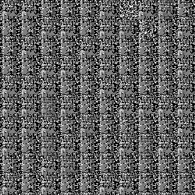
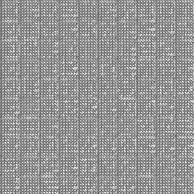
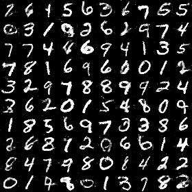
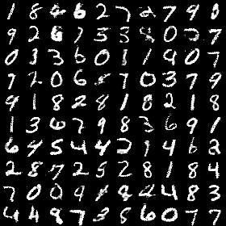
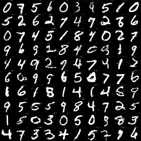
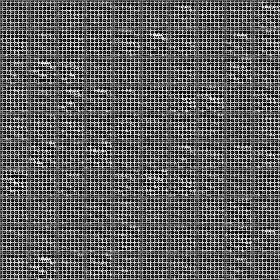
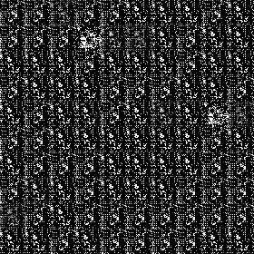
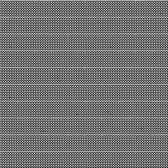
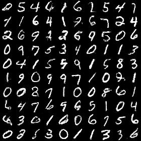
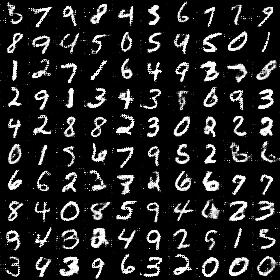

# <p align="center"> f-GAN </p>

Tensorflow implementation of f-GAN (NIPS 2016) - [f-GAN: Training Generative Neural Samplers Using Variational Divergence Minimization](https://arxiv.org/abs/1606.00709).

## TODO

- [ ] make these divergences work (welcome the suggestions)
    - [ ] ***Kullback-Leibler*** with tricky G loss
    - [ ] ***Reverse-KL*** with tricky G loss
    - [x] ***Pearson-X2*** with tricky G loss
    - [ ] ***Squared-Hellinger*** with tricky G loss
    - [x] ***Jensen-Shannon*** with tricky G loss
    - [x] ***GAN*** with tricky G loss
- [ ] test more divergence

## Exemplar Results

- Using tricky G loss (see Section 3.2 in the paper)

    Kullback-Leibler | Reverse-KL | Pearson-X2
    :---: | :---: | :---:
     |  | 
    **Squared-Hellinger** | **Jensen-Shannon** | **GAN**
    NaN |  | 

- Using theoretically correct G loss

    Kullback-Leibler | Reverse-KL | Pearson-X2
    :---: | :---: | :---:
     |  | 
    **Squared-Hellinger** | **Jensen-Shannon** | **GAN**
    NaN |  | 

## Usage

- Prerequisites
    - tensorflow 1.7 or 1.8
    - python 2.7 or 3.6


- Example of training
    - training

        ```console
        CUDA_VISIBLE_DEVICES=0 python train.py --dataset=mnist --divergence=Pearson-X2 --tricky_G
        ```

    - tensorboard for loss visualization

        ```console
        CUDA_VISIBLE_DEVICES='' tensorboard --logdir ./output/mnist_Pearson-X2_trickyG/summaries --port 6006
        ```

## Citation
If you find [f-GAN](https://arxiv.org/abs/1606.00709) useful in your research work, please consider citing:

    @inproceedings{nowozin2016f,
      title={f-GAN: Training Generative Neural Samplers Using Variational Divergence Minimization},
      author={Nowozin, Sebastian and Cseke, Botond and Tomioka, Ryota},
      booktitle={Advances in Neural Information Processing Systems (NIPS)},
      year={2016}
    }